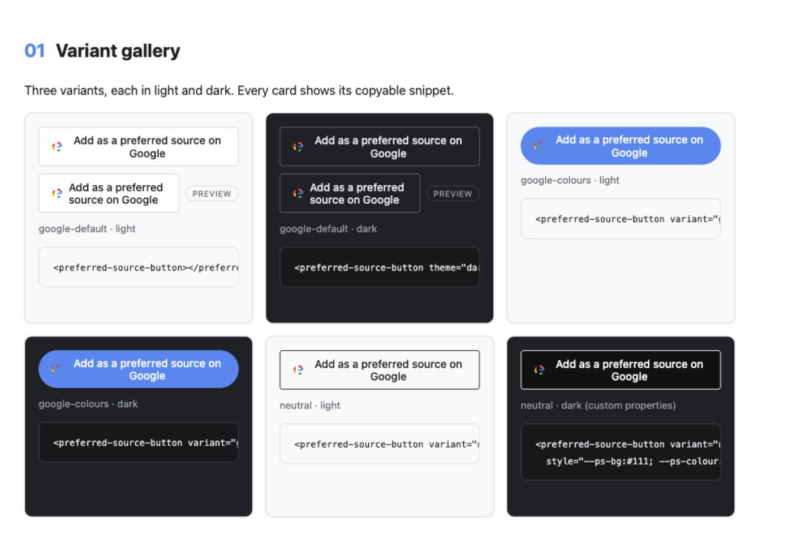

# Add as Preferred Source Button & Popup for Google (SEO & AI Overviews) — web component




_Variant gallery: the web component is the rendered control used for each presentation._

`<preferred-source-button>` brings the official popup trigger, deeplink fallback and `ps-click` event to plain HTML, Angular and other HTML-capable frameworks.

Install from npm with `npm i @opacedev/preferred-source-element`.

## Why publishers use Preferred Sources

The button gives a reader a direct route to choose the publication in Google. Google says fresh and relevant content from a selected source is more likely to appear in that reader's **Top Stories** and may receive a preferred badge in **AI Mode** and **AI Overviews**. Google also reports roughly twice the click-through after a user selects a source.

That is personalisation for the individual reader, not a site-wide ranking factor or a guarantee of traffic, inclusion or AI citations. [Read Google's guidance](https://developers.google.com/search/docs/appearance/preferred-sources) and [click-through finding](https://blog.google/products-and-platforms/products/search/preferred-sources-language-expansion/).

## Use from this repository

```sh
pnpm install
pnpm --filter @opacedev/preferred-source-element build
```

```js
import "@opacedev/preferred-source-element/register";
```

```html
<preferred-source-button
  theme="dark"
  variant="google-colours"
></preferred-source-button>
```

Listen for `ps-click` to record a trigger click. `ps-ready` reports SDK readiness; `ps-fallback` reports that the element changed to Google's deeplink because the SDK was blocked or did not render.

## Attributes and limits

`theme`, `lang`, `mode`, `label`, `variant`, `domain`, `href-fallback`, `disabled` and `render-timeout` are supported. `mode="manual"` is the default for dynamic UI. `mode="auto"` lets Google's renderer use the attributed light-DOM element and falls back if no button appears.

| Attribute                  | Default                          | Purpose                                                                                  |
| -------------------------- | -------------------------------- | ---------------------------------------------------------------------------------------- |
| `theme` / `lang`           | `light` / browser language       | Passed to the documented SDK configuration.                                              |
| `mode`                     | `manual`                         | `auto` renders Google's attributed target; manual mode renders this component's trigger. |
| `label` / `variant`        | Default label / `google-default` | Sets visible text and one of `google-default`, `google-colours` or `neutral`.            |
| `domain` / `href-fallback` | Current hostname / computed link | Sets the preferred hostname or an explicit fallback URL.                                 |
| `disabled`                 | Absent                           | Prevents trigger activation.                                                             |
| `render-timeout`           | `4000` ms                        | Auto-mode time allowed after SDK load before a no-render fallback.                       |

| Event         | Meaning                                                                               |
| ------------- | ------------------------------------------------------------------------------------- |
| `ps-click`    | A user activated the trigger; its detail includes mode, theme, language and domain.   |
| `ps-ready`    | The SDK is ready for the selected mode.                                               |
| `ps-fallback` | The component switched to the deeplink because the SDK was blocked or did not render. |

The component uses a native button or link, visible focus styles and reduced-motion handling. Validate contrast when overriding `--ps-*` properties. It is safe to import in SSR bundles, but server output remains an unknown custom element until client hydration.

Style with `--ps-bg`, `--ps-colour`, `--ps-radius`, `--ps-font-family`, `--ps-hover-bg`, `--ps-lift` and `--ps-focus-ring`, or with `::part(button)`, `::part(fallback)` and `::part(container)`.

> **Limitation.** Google's SDK has no completion callback or event. `ps-click` measures a trigger click, not a confirmed addition.

## External service and troubleshooting

Browser use loads Google's publisher script. The element does not send `ps-click` anywhere or store event records; your application chooses whether to listen. When `ps-fallback` fires, keep the rendered link, then check consent, CSP, the configured domain and any overridden `render-timeout` before expecting Google's button.

See the [live demo](https://opacedigitalagency.github.io/add-as-preferred-source-button-for-google/) and the [root README](../../README.md) for requirements, privacy and troubleshooting.

---

Source: [suite repository](https://github.com/OpaceDigitalAgency/add-as-preferred-source-button-for-google) · Support: [GitHub issues](https://github.com/OpaceDigitalAgency/add-as-preferred-source-button-for-google/issues) · [Product hub](https://opace.agency/add-as-preferred-source-button-for-google/) · [Opace SEO services](https://opace.agency/services/seo/) · [Opace on GitHub](https://github.com/OpaceDigitalAgency) · [MIT licence](LICENSE)
