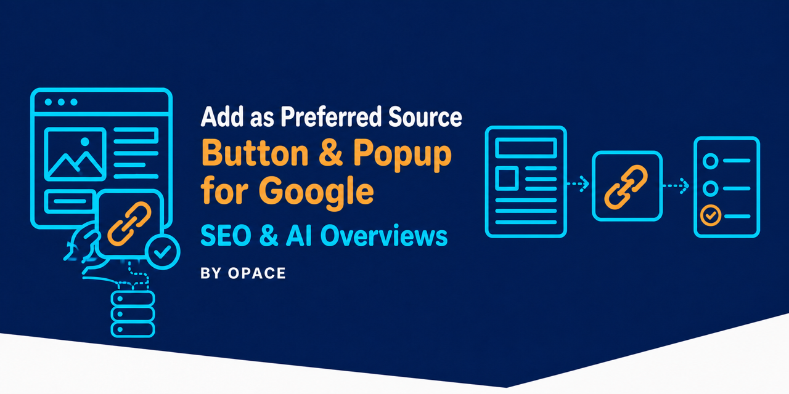

# Add as Preferred Source Button & Popup for Google (SEO & AI Overviews) — Svelte and SvelteKit




_Variant gallery: Svelte and SvelteKit render the same button shell and fallback path._

`@opace/svelte-preferred-source` is a Svelte component that loads the SDK in `onMount`, emits `ps-click`, and switches to the documented deeplink if the SDK is unavailable.

**Status:** built and tested in this repository, but **not published to npm**. The future command is `npm i @opace/svelte-preferred-source`; use the workspace first.

## Why publishers use Preferred Sources

The button gives a reader a direct route to choose the publication in Google. Google says fresh and relevant content from a selected source is more likely to appear in that reader's **Top Stories** and may receive a preferred badge in **AI Mode** and **AI Overviews**. Google also reports roughly twice the click-through after a user selects a source.

That is personalisation for the individual reader, not a site-wide ranking factor or a guarantee of traffic, inclusion or AI citations. [Read Google's guidance](https://developers.google.com/search/docs/appearance/preferred-sources) and [click-through finding](https://blog.google/products-and-platforms/products/search/preferred-sources-language-expansion/).

## Use from this repository

```sh
pnpm install
pnpm --filter @opace/svelte-preferred-source build
```

```svelte
<script>
  import { PreferredSourceButton } from '@opace/svelte-preferred-source';
</script>

<PreferredSourceButton theme="light" variant="neutral" on:ps-click={track} />
```

## Requirements and limits

- Svelte 4 or 5 and Node.js 18+ for development.
- SvelteKit renders the button shell on the server; SDK work begins on mount.
- Props include `theme`, `lang`, `mode`, `label`, `variant`, `domain` and `hrefFallback`.
- Auto mode is best for static markup; manual mode is the default for dynamic UI.

| Prop / event                     | Default                                     | Notes                                                                         |
| -------------------------------- | ------------------------------------------- | ----------------------------------------------------------------------------- |
| `theme`, `lang`, `domain`        | `light`, browser language, current hostname | SDK configuration and fallback hostname.                                      |
| `mode`                           | `manual`                                    | `auto` renders the attributed static target.                                  |
| `label`, slot, `variant`         | Standard label, none, `google-default`      | The slot replaces the label; variants include `google-colours` and `neutral`. |
| `hrefFallback`                   | Computed deeplink                           | Overrides the fallback target.                                                |
| `renderTimeoutMs`                | `4000` ms                                   | Auto-mode time allowed after SDK load before fallback.                        |
| `on:ps-click` / `on:ps-fallback` | None                                        | Receives click detail or a `blocked`/`no-render` fallback reason.             |

> **Limitation.** Google's SDK has no completion callback or event. `ps-click` measures a trigger click, not a confirmed addition.

## External service and troubleshooting

Browser use loads Google's publisher script after `onMount`. The component does not send `ps-click` anywhere or store event records; your app chooses whether to listen. If `on:ps-fallback` reports `blocked` or `no-render`, keep the deeplink and check consent, CSP and the eligible domain before retrying the popup.

See the [root README](../../README.md) for consent, CSP, eligibility and fallback guidance.

---

Source: [suite repository](https://github.com/OpaceDigitalAgency/add-as-preferred-source-button-for-google) · Support: [GitHub issues](https://github.com/OpaceDigitalAgency/add-as-preferred-source-button-for-google/issues) · [Live demo](https://opacedigitalagency.github.io/add-as-preferred-source-button-for-google/) · [Opace SEO services](https://opace.agency/services/seo/) · [Opace on GitHub](https://github.com/OpaceDigitalAgency) · [MIT licence](LICENSE)
