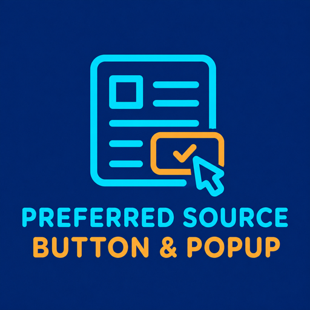
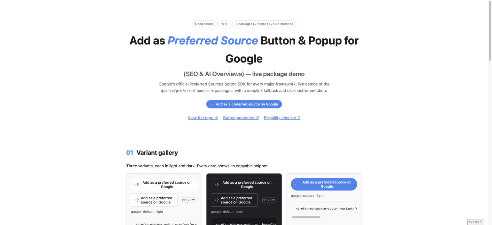

# Add as Preferred Source Button & Popup for Google (SEO & AI Overviews) — Vue and Nuxt






_Shared live component demo capture: Vue and Nuxt mount the same trigger and deeplink fallback._

`@opace/vue-preferred-source` provides a Vue 3 component, `usePreferredSource()` composable and global plugin. It loads the SDK in `onMounted` and falls back to the documented deeplink when necessary.

**Status:** built and tested in this repository, but **not published to npm**. The future command is `npm i @opace/vue-preferred-source`; use the workspace first.

## Use from this repository

```sh
pnpm install
pnpm --filter @opace/vue-preferred-source build
```

```vue
<script setup>
import { PreferredSourceButton } from "@opace/vue-preferred-source";
</script>

<template>
  <PreferredSourceButton
    theme="dark"
    variant="google-colours"
    @ps-click="track"
  />
</template>
```

```vue
<script setup>
import {
  PreferredSourcePlugin,
  usePreferredSource,
} from "@opace/vue-preferred-source";

const { status, open, deeplink } = usePreferredSource({
  theme: "light",
  lang: "en",
});
// Register globally in your application with app.use(PreferredSourcePlugin).
</script>
```

## Requirements and limits

- Vue 3.3+ and Node.js 18+ for development.
- The component is SSR-safe by design: Nuxt renders its shell and browser work begins in `onMounted`.
- Props include `theme`, `lang`, `mode`, `label`, `variant`, `domain` and `hrefFallback`.
- `ps-click` reports a click, not a completed Google preference action.

| Prop / event               | Default                                     | Notes                                                                         |
| -------------------------- | ------------------------------------------- | ----------------------------------------------------------------------------- |
| `theme`, `lang`, `domain`  | `light`, browser language, current hostname | SDK configuration and fallback hostname.                                      |
| `mode`                     | `manual`                                    | `auto` renders the attributed static target.                                  |
| `label`, slot, `variant`   | Standard label, none, `google-default`      | The slot replaces the label; variants include `google-colours` and `neutral`. |
| `hrefFallback`             | Computed deeplink                           | Overrides the fallback target.                                                |
| `renderTimeoutMs`          | `4000` ms                                   | Auto-mode time allowed after SDK load before fallback.                        |
| `ps-click` / `ps-fallback` | None                                        | Emits click detail or a `blocked`/`no-render` fallback reason.                |

`usePreferredSource()` returns reactive `status` and `deeplink` refs plus `open()`. `PreferredSourcePlugin` registers `<PreferredSourceButton>` globally.

> **Limitation.** Google's SDK has no completion callback or event. `ps-click` measures a trigger click, not a confirmed addition.

## External service and troubleshooting

Browser use loads Google's publisher script after `onMounted`. The package does not send `ps-click` anywhere or store event records; your application decides what to do with the event. If `ps-fallback` fires, preserve the deeplink and check consent, CSP, client-only mounting and the eligible domain before retrying the popup.

See the [root README](../../README.md) for consent, CSP, eligibility and fallback guidance.

---

Source: [suite repository](https://github.com/OpaceDigitalAgency/add-as-preferred-source-button-for-google) · Support: [GitHub issues](https://github.com/OpaceDigitalAgency/add-as-preferred-source-button-for-google/issues) · [Live demo](https://opacedigitalagency.github.io/add-as-preferred-source-button-for-google/) · [Opace SEO services](https://opace.agency/services/seo/) · [Opace on GitHub](https://github.com/OpaceDigitalAgency) · [MIT licence](LICENSE)
