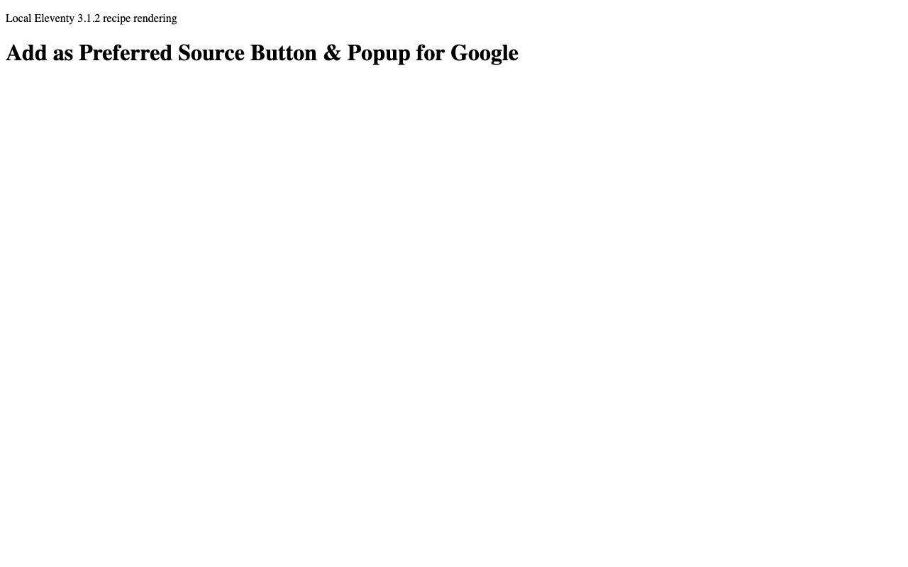
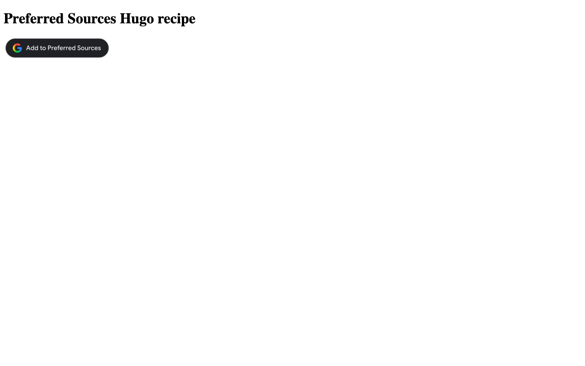
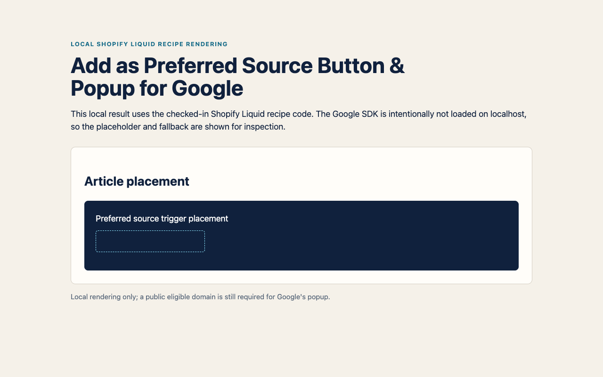

# Add as Preferred Source Button & Popup for Google (SEO & AI Overviews) — reference recipes

_Shared live component demo capture: each reference recipe aims to place this documented trigger on a staging site._

## Local recipe renderings

The captures below are local, platform-specific recipe renderings. They prove the checked-in snippets emit their documented placeholders; they do not claim that Google's popup can work on localhost.

_Local Eleventy 3.1.2 rendering of the checked-in shortcode._

_Local Hugo 0.147.0 rendering of the checked-in partial._

_Local Shopify Liquid rendering of the checked-in snippet._

Copy-paste reference recipes for adding Google's Preferred Sources button to static-site, CMS and site-builder projects. They use Google's documented automatic mode and a deeplink fallback; no package installation is required.

Each guide identifies the checked-in source file, the placement point and the rendered result to verify. Treat the snippets as starting points for the platform version and theme used by your project.

> **Check eligibility first.** Google supports domains and subdomains, not individual subdirectories. `example.com` and `news.example.com` can be eligible; `example.com/blog` cannot be preferred separately. Confirm that your domain appears in Google's [source preferences tool](https://www.google.com/preferences/source) before implementation.

| Platform | Reference recipe                            |
| -------- | ------------------------------------------- |
| Hugo     | [Hugo partial](hugo/README.md)              |
| Jekyll   | [Jekyll include](jekyll/README.md)          |
| Eleventy | [Eleventy shortcode](eleventy/README.md)    |
| Ghost    | [Ghost code injection](ghost/README.md)     |
| Webflow  | [Webflow custom code](webflow/README.md)    |
| Framer   | [Framer code component](framer/README.md)   |
| Shopify  | [Shopify Liquid snippet](shopify/README.md) |

## Validate before release

Use a public, domain-based staging or production URL for the final check. Localhost and other non-public hosts are not eligible for Google's popup. Confirm the source in Google's tool, then check the placed element is visible and that the no-JavaScript link opens the matching domain.

## Scope, privacy and support

These are reference recipes, not recorded tests of every hosted platform version. They load Google's publisher script where instructed and do not send data to Opace. Keep the fallback link, apply the consent and CSP rules used by your site, and use the linked source repository or Opace support route if a recipe needs adapting.

---

[Product hub](https://opace.agency/add-as-preferred-source-button-for-google/) · [Button generator](https://opace.agency/add-as-preferred-source-button-for-google/button-generator/) · [Eligibility checker](https://opace.agency/add-as-preferred-source-button-for-google/button-checker/) · [Google implementation guide](https://developers.google.com/search/docs/appearance/preferred-sources) · [Source repository](https://github.com/OpaceDigitalAgency/add-as-preferred-source-button-for-google) · [Opace SEO services](https://opace.agency/services/seo/) · [Opace on GitHub](https://github.com/OpaceDigitalAgency) · [Opace support](https://opace.agency/add-as-preferred-source-button-for-google/) · [MIT licence](../LICENSE)
