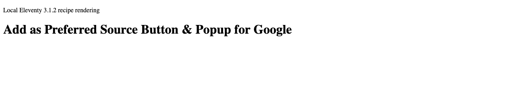
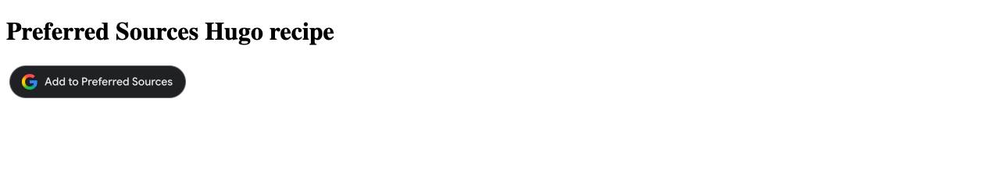
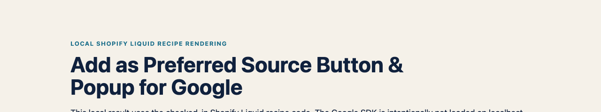

# Add as Preferred Source Button & Popup for Google (SEO & AI Overviews) — reference recipes

_The common outcome across the recipes: a visible, accessible Google Preferred Sources trigger with a documented fallback._

## What these pages are

These are public GitHub implementation guides for platforms that do not need a maintained JavaScript package. A recipe is copied into the publisher's own theme or site project; it is not a separate hosted page, app, plugin or npm package.

| Choose               | When it fits                                                                                                             | Destination                                                                                                                        |
| -------------------- | ------------------------------------------------------------------------------------------------------------------------ | ---------------------------------------------------------------------------------------------------------------------------------- |
| A framework package  | You use TypeScript, React, Vue, Svelte, Astro or a web component and want types, lifecycle handling, tests and releases. | Install the matching npm package; source and release history are in [`packages/`](../packages/).                                   |
| A reference recipe   | You use Hugo, Jekyll, Eleventy, Ghost, Webflow, Framer or Shopify and want the smallest copy-and-adapt implementation.   | The platform's theme, template or custom-code area.                                                                                |
| The WordPress plugin | You need managed placement, conversion triggers, analytics, consent or multisite controls.                               | [Separate WordPress repository](https://github.com/OpaceDigitalAgency/add-as-preferred-source-button-for-google-wordpress-plugin). |
| Chrome Site Checker | You want to audit a live implementation before changing its code. | [Install the free Chrome extension](https://chromewebstore.google.com/detail/add-as-preferred-source-b/dnifhlampnjpfigeniaoihblbdegijgp). |

## Why publishers add the button

Google says fresh and relevant content from a reader's selected source is more likely to appear in that reader's **Top Stories** and may receive a preferred badge in **AI Mode** and **AI Overviews**. Google also reports roughly twice the click-through after a user selects a source.

This is personalisation for that reader, not a site-wide ranking factor or a guarantee of traffic, inclusion or AI citations. The recipe simply creates a clear opt-in path and preserves a deeplink when the popup cannot render. [Read Google's publisher guidance](https://developers.google.com/search/docs/appearance/preferred-sources) and [click-through finding](https://blog.google/products-and-platforms/products/search/preferred-sources-language-expansion/).

## Local recipe renderings

The captures below are local, platform-specific recipe renderings. They prove the checked-in snippets emit their documented placeholders; they do not claim that Google's popup can work on localhost.

_Local Eleventy 3.1.2 rendering of the checked-in shortcode._

_Local Hugo 0.147.0 rendering of the checked-in partial._

_Local Shopify Liquid rendering of the checked-in snippet._

Copy-paste reference recipes for adding Google's Preferred Sources button to static-site, CMS and site-builder projects. They use Google's documented automatic or manual mode and a deeplink fallback; no package installation is required.

Each guide identifies the checked-in source file, the placement point and the rendered result to verify. Treat the snippets as starting points for the platform version and theme used by your project.

> **Check eligibility first.** Google supports domains and subdomains, not individual subdirectories. `example.com` and `news.example.com` can be eligible; `example.com/blog` cannot be preferred separately. Confirm that your domain appears in Google's [source preferences tool](https://www.google.com/preferences/source) before implementation.

| Platform | Reference recipe                            |
| -------- | ------------------------------------------- |
| Hugo     | [Hugo partial](hugo/README.md)              |
| Jekyll   | [Jekyll include](jekyll/README.md)          |
| Eleventy | [Eleventy shortcode](eleventy/README.md)    |
| Ghost    | [Ghost code injection](ghost/README.md)     |
| Webflow  | [Webflow custom code](webflow/README.md)    |
| Framer   | [Framer code component](framer/README.md)   |
| Shopify  | [Shopify Liquid snippet](shopify/README.md) |

## Validate before release

Use a public, domain-based staging or production URL for the final check. Localhost and other non-public hosts are not eligible for Google's popup. Confirm the source in Google's tool, then check the placed element is visible and that the no-JavaScript link opens the matching domain.

## Scope, privacy and support

These are reference recipes, not recorded tests of every hosted platform version. They load Google's publisher script where instructed and do not send data to Opace. Keep the fallback link, apply the consent and CSP rules used by your site, and use the linked source repository or Opace support route if a recipe needs adapting.

---

[Product hub](https://opace.agency/tools/suite/add-as-preferred-source-button-for-google/) · [Button generator](https://opace.agency/tools/suite/add-as-preferred-source-button-for-google/button-generator/) · [Eligibility checker](https://opace.agency/tools/suite/add-as-preferred-source-button-for-google/button-checker/) · [Install the Chrome Site Checker](https://chromewebstore.google.com/detail/add-as-preferred-source-b/dnifhlampnjpfigeniaoihblbdegijgp) · [Google implementation guide](https://developers.google.com/search/docs/appearance/preferred-sources) · [Source repository](https://github.com/OpaceDigitalAgency/add-as-preferred-source-button-for-google) · [Opace SEO services](https://opace.agency/services/seo/) · [Opace on GitHub](https://github.com/OpaceDigitalAgency) · [Opace support](https://opace.agency/tools/suite/add-as-preferred-source-button-for-google/) · [MIT licence](../LICENSE)
