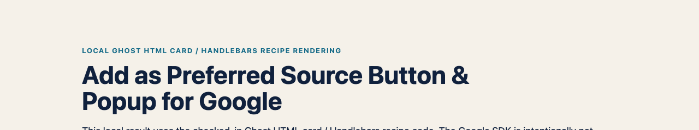

# Add as Preferred Source Button & Popup for Google (SEO & AI Overviews) — Ghost reference recipe


_Shared live component demo capture: verify the Ghost HTML card renders this trigger on staging._



_Local Ghost HTML-card/Handlebars recipe rendering: the checked-in automatic-mode placeholder is shown at article placement. The Google SDK is intentionally not loaded on localhost._

This recipe uses Ghost code injection for the SDK and an HTML card for Google's documented automatic-mode placeholder.

## Why this matters for publishers

Google says fresh and relevant content from a reader's selected source is more likely to appear in that reader's **Top Stories** and may receive a preferred badge in **AI Mode** and **AI Overviews**. Google also reports roughly twice the click-through after a user selects a source.

This is personalisation for that reader, not a site-wide ranking factor or a guarantee of traffic, inclusion or AI citations. The recipe creates the opt-in path; Google still decides which content appears. [Read Google's publisher guidance](https://developers.google.com/search/docs/appearance/preferred-sources).

> **Check eligibility first.** Google supports domains and subdomains, not individual subdirectories. `example.com` and `news.example.com` can be eligible; `example.com/blog` cannot be preferred separately. Confirm that your domain appears in Google's [source preferences tool](https://www.google.com/preferences/source) before implementation.

## Add the SDK and placement

1. In Ghost admin, open **Settings → Code injection → Site header** and add:

```html
<script async src="https://news.google.com/swg/js/v1/publisher.js"></script>
```

2. Add an **HTML card** to the post or page at the intended button position:

```html
<div google-add-preferred-source-btn data-theme="light"></div>
```

3. Use `data-theme="dark"` where the surrounding section needs Google's dark button.
4. For a shared post placement, add the placeholder to the relevant theme template instead of each individual HTML card.

## Expected behaviour and validation

Google's automatic mode scans the placeholder after the page loads. On a public eligible domain, inspect a published post or page to confirm the placeholder is visible and Google's button has rendered. Include a no-JavaScript link where appropriate and test it with the SDK blocked:

```html
<a
  href="https://www.google.com/preferences/source?q=example.com"
  target="_blank"
  rel="noopener noreferrer"
  >Add as a preferred source on Google</a
>
```

## Scope, privacy and troubleshooting

This is a reference recipe, not a recorded Ghost deployment test. It loads Google's publisher script and does not send data to Opace. If no button renders, keep the fallback link and check Site header injection, the published page's CSP and consent rules, and the eligible public domain.

---

[Product hub](https://opace.agency/add-as-preferred-source-button-for-google/) · [Button generator](https://opace.agency/add-as-preferred-source-button-for-google/button-generator/) · [Eligibility checker](https://opace.agency/add-as-preferred-source-button-for-google/button-checker/) · [Google implementation guide](https://developers.google.com/search/docs/appearance/preferred-sources) · [Source repository](https://github.com/OpaceDigitalAgency/add-as-preferred-source-button-for-google) · [Opace SEO services](https://opace.agency/services/seo/) · [Opace on GitHub](https://github.com/OpaceDigitalAgency) · [Opace support](https://opace.agency/add-as-preferred-source-button-for-google/) · [MIT licence](../../LICENSE)
