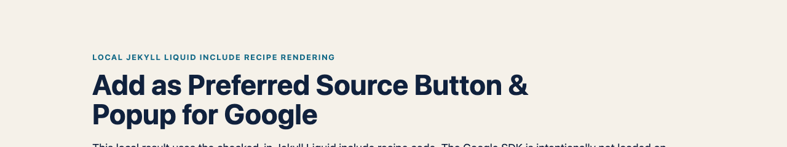

# Add as Preferred Source Button & Popup for Google (SEO & AI Overviews) — Jekyll reference recipe


_Shared live component demo capture: verify the Jekyll include renders this trigger on staging._



_Local Jekyll-compatible Liquid recipe rendering: the checked-in include emitted the dark, English placeholder at article placement. Jekyll itself was unavailable locally; the Google SDK is intentionally not loaded on localhost._

This include outputs Google's documented automatic-mode placeholder and a no-JavaScript deeplink.

## Why this matters for publishers

Google says fresh and relevant content from a reader's selected source is more likely to appear in that reader's **Top Stories** and may receive a preferred badge in **AI Mode** and **AI Overviews**. Google also reports roughly twice the click-through after a user selects a source.

This is personalisation for that reader, not a site-wide ranking factor or a guarantee of traffic, inclusion or AI citations. The recipe creates the opt-in path; Google still decides which content appears. [Read Google's publisher guidance](https://developers.google.com/search/docs/appearance/preferred-sources).

> **Check eligibility first.** Google supports domains and subdomains, not individual subdirectories. `example.com` and `news.example.com` can be eligible; `example.com/blog` cannot be preferred separately. Confirm that your domain appears in Google's [source preferences tool](https://www.google.com/preferences/source) before implementation.

## Add the include

1. Copy [`preferred-source.html`](preferred-source.html) into `_includes/`.
2. Add the SDK once in `_includes/head.html` or the theme's equivalent:

```html
<script async src="https://news.google.com/swg/js/v1/publisher.js"></script>
```

3. Add the include at the intended button position:

```liquid

```

4. If the head cannot be edited, set `include_script=true` on the include.

## Expected behaviour and validation

Google's automatic mode scans the included `google-add-preferred-source-btn` element. On a public eligible domain, inspect the deployed page to confirm the placeholder is visible and Google's button has rendered. The fallback derives its query from `site.url`; verify that it contains the intended domain and test the link with JavaScript disabled.

The include uses built-in Liquid syntax and needs no custom Jekyll plugin, so it suits GitHub Pages builds. A remote theme may control the head include; use that theme's documented override point and confirm the SDK appears only once in the generated HTML.

## Scope, privacy and troubleshooting

This is a reference recipe, not a recorded Jekyll deployment test. It loads Google's publisher script and does not send data to Opace. If no button appears, keep the fallback link and inspect the generated HTML, the theme's head override, CSP, consent and the public eligible domain.

---

[Product hub](https://opace.agency/add-as-preferred-source-button-for-google/) · [Button generator](https://opace.agency/tools/suite/add-as-preferred-source-button-for-google/button-generator/) · [Eligibility checker](https://opace.agency/add-as-preferred-source-button-for-google/button-checker/) · [Google implementation guide](https://developers.google.com/search/docs/appearance/preferred-sources) · [Source repository](https://github.com/OpaceDigitalAgency/add-as-preferred-source-button-for-google) · [Opace SEO services](https://opace.agency/services/seo/) · [Opace on GitHub](https://github.com/OpaceDigitalAgency) · [Opace support](https://opace.agency/add-as-preferred-source-button-for-google/) · [MIT licence](../../LICENSE)
