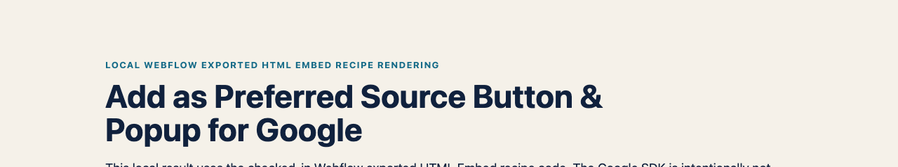

# Add as Preferred Source Button & Popup for Google (SEO & AI Overviews) — Webflow reference recipe


_Shared live component demo capture: verify the Webflow Embed renders this trigger on staging._



_Local Webflow exported-HTML recipe rendering: the checked-in Embed placeholder is shown at article placement. The Google SDK is intentionally not loaded on localhost._

This recipe uses Webflow custom code for the SDK and an Embed element for Google's documented automatic-mode placeholder.

## Why this matters for publishers

Google says fresh and relevant content from a reader's selected source is more likely to appear in that reader's **Top Stories** and may receive a preferred badge in **AI Mode** and **AI Overviews**. Google also reports roughly twice the click-through after a user selects a source.

This is personalisation for that reader, not a site-wide ranking factor or a guarantee of traffic, inclusion or AI citations. The recipe creates the opt-in path; Google still decides which content appears. [Read Google's publisher guidance](https://developers.google.com/search/docs/appearance/preferred-sources).

> **Check eligibility first.** Google supports domains and subdomains, not individual subdirectories. `example.com` and `news.example.com` can be eligible; `example.com/blog` cannot be preferred separately. A `webflow.io` subdomain is not your publication domain.

## Add the SDK and placement

1. Open **Site Settings → Custom Code → Head Code** and add:

```html
<script async src="https://news.google.com/swg/js/v1/publisher.js"></script>
```

2. In Designer, place an **Embed** element at the intended button position and add:

```html
<div google-add-preferred-source-btn data-theme="light"></div>
```

3. Use `data-theme="dark"` where the surrounding section needs Google's dark button.
4. Publish to the connected custom domain.

## Expected behaviour and validation

Google's automatic mode scans the Embed element after the page loads. On a public eligible domain, inspect the deployed page to confirm the placeholder is visible and Google's button has rendered. Add a regular link for no-JavaScript visitors and confirm that its `q` value is the same eligible domain:

```text
https://www.google.com/preferences/source?q=example.com
```

## Scope, privacy and troubleshooting

This is a reference recipe, not a recorded Webflow deployment test. It loads Google's publisher script and does not send data to Opace. If no button renders, keep the fallback link and check the published custom domain, Head Code, CSP and consent rules before retrying.

---

[Product hub](https://opace.agency/add-as-preferred-source-button-for-google/) · [Button generator](https://opace.agency/add-as-preferred-source-button-for-google/button-generator/) · [Eligibility checker](https://opace.agency/add-as-preferred-source-button-for-google/button-checker/) · [Google implementation guide](https://developers.google.com/search/docs/appearance/preferred-sources) · [Source repository](https://github.com/OpaceDigitalAgency/add-as-preferred-source-button-for-google) · [Opace SEO services](https://opace.agency/services/seo/) · [Opace on GitHub](https://github.com/OpaceDigitalAgency) · [Opace support](https://opace.agency/add-as-preferred-source-button-for-google/) · [MIT licence](../../LICENSE)
